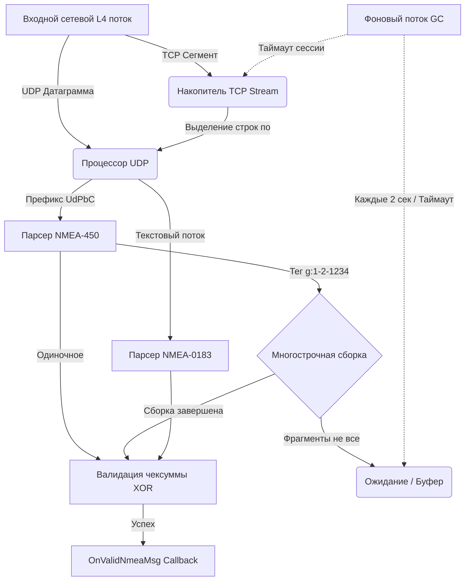

# NMEA Layer 4 Stream Processor

Высокопроизводительный потокобезопасный C++ компонент (C++17) для сетевого прикладного парсинга и дефрагментации навигационных сообщений. Предназначен для работы на уровне L4 (транспортном) после обработки IP-заголовков внешним модулем.

Поддерживает параллельный разбор классического текстового стриминга **NMEA 0183**, сетевого стандарта **NMEA-450 (IEC 61162-450 Light-Weight Ethernet)**, а также автоматическую сборку многострочных фрагментированных предложений (*Sentence Grouping*).

---

## 🚀 Ключевые особенности

- **Мультипротокольность:** Автоматическое разделение и парсинг монолитных датаграмм UDP (NMEA 0183 / NMEA-450) и непрерывных байтовых потоков TCP.
- **Потоковый TCP-автомат:** Интегрирован скользящий кольцевой буфер накопления сессий (`TcpStreamBuffer`). Корректно склеивает NMEA-строки, если TCP-сегмент разорван посередине сообщения, и обрабатывает пачки из нескольких строк в одном пакете.
- **Дефрагментация NMEA-450 (*Sentence Grouping*):** Парсинг TAG-блоков метаданных (`\c:...,s:...,g:...\`). Автоматическая сборка многострочных сообщений по тегу `g:[current]-[total]-[group_id]`.
- **Изоляция сессий:** Ключи сборки привязаны к паре `Source_ID` + `Group_ID`. Исключено перемешивание данных при одновременной передаче многострочных пакетов с одинаковыми ID от разных физических датчиков.
- **Thread-Safety & High-Throughput:** Все критические секции защищены `std::mutex`. Процессор спроектирован под высокие сетевые нагрузки реального времени на бортовых вычислителях.
- **Zero-Latency Garbage Collector:** Выделенный фоновый низкоприоритетный поток очистки устаревших сессий (на базе `std::condition_variable` вместо «глухих» `sleep`). Адаптивное системное понижение приоритета (Win32 `THREAD_PRIORITY_BELOW_NORMAL` / POSIX `nice(10)`).

---

## 💎 Архитектурный анализ и технические преимущества

### 1. Архитектурная корректность L4-конвейера
- **Потоковый TCP-автомат общего назначения (`ProcTcpSegment`):** В отличие от UDP, TCP не гарантирует сохранение границ сообщений. Реализованный алгоритм осуществляет сквозную склейку: если TCP-пакет режется посередине предложения, метод сохраняет остаток в накопитель и дописывает к нему данные из следующего пакета, корректно обрабатывая циклом все закрывшиеся строки `\n`.
- **Умный селектор протоколов:** Метод `ProcUdpDatagram` атомарно определяет, имеет ли он дело с Ethernet-стандартом NMEA-450 (анализируя префикс `UdPbC`) или перед нами обычный широковещательный UDP-броадкаст старого текстового вида NMEA-0183.
- **Изоляция контекста Sentence Grouping:** Уникальный идентификатор многострочной группы формируется динамически как комбинация `source_id + group_id`. Это гарантирует, что если два разных датчика (например, два АИС-приемника на борту) одновременно отправят многострочные пакеты с одинаковым внутренним ID `1234`, наш пулер не смешает их строки в кашу.

### 2. Оптимизация фоновой очистки (Garbage Collection)
- **Использование `std::condition_variable::wait_for` вместо `sleep_for`:** Использование условной переменной обеспечивает **мгновенный деструктор (Zero-latency Shutdown)**. Если приложение экстренно закрывается, поток очистки не заставит процесс зависать в диспетчере задач, пока дотикает стандартный таймер, а мгновенно проснется по триггеру и завершится.
- **Адаптивное понижение приоритета (Win32 / POSIX):** Фоновый поток очистки задействует процессор только в те микросекунды, когда ядро ОС полностью свободно от обработки сетевых прерываний и разбора основных UDP/TCP буферов. Это полностью исключает появление задержек (jitter) в основном высокоскоростном сетевом потоке.
- **Безопасный RAII-дизайн:** Деструктор управляющего класса автоматически останавливает фоновый поток. Это полностью исключает проблему `std::terminate`, которая происходит в C++, если объект уничтожается до завершения его внутренних потоков.

---

## 🛠️ Архитектура конвейера данных



---

## ⚙️ Требования к окружению

- **Язык:** C++17 или новее.
- **Компилятор:** MSVC (Visual Studio 2019+), GCC (g++ 9+), или Clang 10+.
- **ОС:** Кроссплатформенно (Windows / Linux).

---

## 📦 Интеграция в проект

Компонент спроектирован на базе принципа открытости к расширению. Для интеграции со своей бизнес-логикой унаследуйте класс `nmea_service` и переопределите виртуальный метод `OnValidNmeaMsg`.

### Пример реализации:

```cpp
#include "nmea_service.h"
#include <memory>

class MyNmeaDispatcher : public nmea_service {
protected:
    void OnValidNmeaMsg(const std::string& nmea_sentence, const std::string& source_id) override {
        // Логика обработки очищенной и дефрагментированной строки
        if (nmea_sentence.rfind("\$GPRMC", 0) == 0) {
            // Отправка в парсер координат
        }
        // Системный лог
        std::cout << "[DISPATCHER] Source: " << source_id << " | Data: " << nmea_sentence << std::endl;
    }
};

int main() {
    // 1. Инициализация сервиса
    auto nmea_processor = std::make_unique<MyNmeaDispatcher>();
    
    // 2. Запуск фонового низкоприоритетного сборщика мусора (таймаутов)
    nmea_processor->StartTimeoutCleaner();

    // Пример интеграции в ваш сетевой цикл (UDP-трафик):
    // uint8_t* udp_data = ...; size_t len = ...;
    // nmea_processor->ProcUdpDatagram(udp_data, len);

    // Пример интеграции в ваш сетевой цикл (TCP-трафик):
    // nmea_processor->ProcTcpSegment(src_ip, dst_ip, src_port, dst_port, tcp_data, len);

    // Безопасный останов при выходе из приложения (поддерживается RAII)
    nmea_processor->StopTimeoutCleaner();
    return 0;
}
```

---

## ⏱️ Политика управления таймаутами (Внутренние константы)

Фоновый очиститель работает в неблокирующем режиме и предотвращает утечки памяти (Memory Leaks) при потере сетевых пакетов:
- `NMEA_GROUP_TIMEOUT = 3 секунды`: если многострочное сообщение (например, тяжелая сессия AIS) не дособралось за 3 секунды из-за потери UDP-пакета, незавершенные фрагменты удаляются.
- `TCP_SESSION_TIMEOUT = 5 минут`: если TCP-клиент «умер» (отключился без отправки FIN/RST пакетов), буфер сессии автоматически вычищается из памяти кучи через 5 минут простоя.

---

## 🏗️ Сборка через CMake

Проект легко интегрируется в общую систему сборки через `CMakeLists.txt`:

```cmake
# Добавление в ваш проект
add_executable(my_network_app 
    main.cpp
    nmea_processor.cpp
    nmea_service.cpp
)
```
